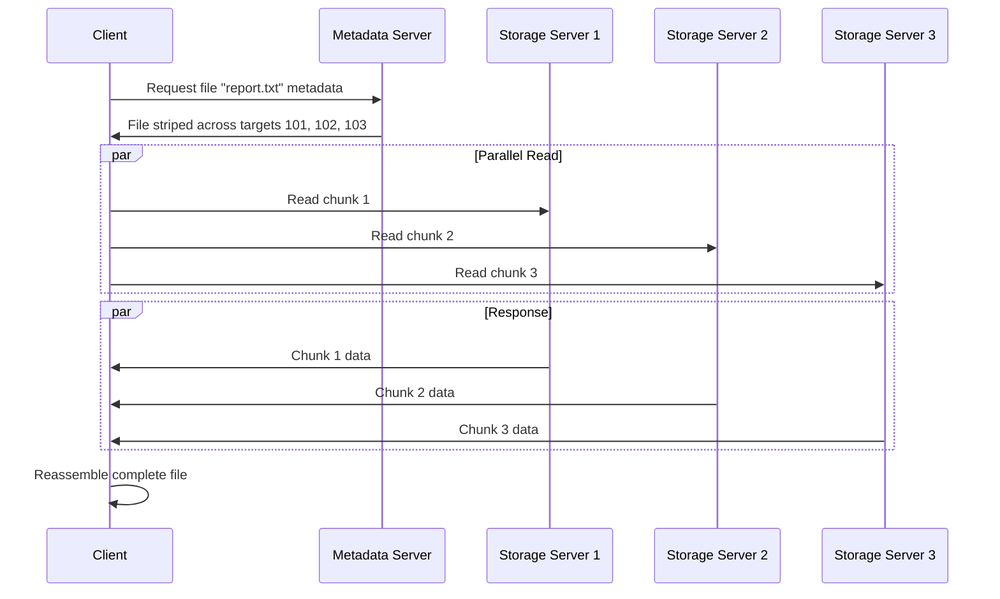
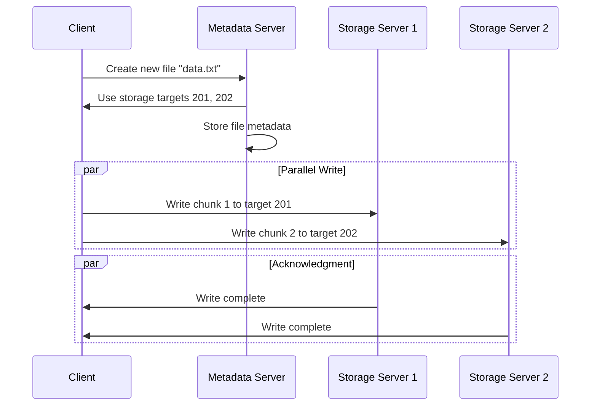
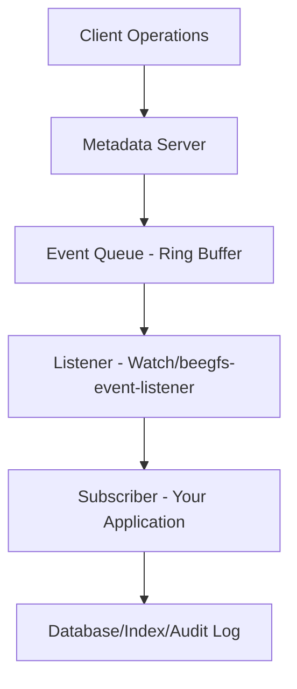

# BeeGFS Architecture

This document provides a comprehensive overview of BeeGFS (BeeGFS Parallel File System) architecture, components, and key concepts.

---

## 📋 Table of Contents

1. [Introduction](#introduction)
2. [High-Performance Computing (HPC) Basics](#high-performance-computing-hpc-basics)
3. [BeeGFS Core Components](#beegfs-core-components)
4. [File Operations Flow](#file-operations-flow)
5. [Storage Architecture](#storage-architecture)
6. [Mirroring & Redundancy](#mirroring--redundancy)
7. [Event System](#event-system)
8. [BeeOND (BeeGFS On Demand)](#beeond-beegfs-on-demand)
9. [Advanced Features](#advanced-features)

---

## Introduction

BeeGFS is a **parallel cluster file system** designed for high-performance computing environments. It provides high throughput and low latency by distributing file data across multiple storage servers and allowing parallel access.

### Key Benefits:
- **High Performance**: Parallel I/O across multiple storage nodes
- **Scalability**: Can scale to thousands of nodes
- **Flexibility**: Supports various storage configurations
- **Fault Tolerance**: Built-in mirroring and redundancy options

---

## High-Performance Computing (HPC) Basics

| **Term** | **Definition** |
|----------|----------------|
| **Node** | A single computer in the cluster |
| **Cluster** | A group of interconnected nodes |
| **Core** | Processing unit within a CPU. Multiple cores per CPU |

---

## BeeGFS Core Components

BeeGFS consists of several key services that work together:

### 🧭 1. Management Service (beegfs-mgmtd)

**Purpose**: The "reception desk" of the BeeGFS system.

**Responsibilities**:
- **Service Discovery**: Keeps a list of all active services (metadata, storage, clients)
- **Health Monitoring**: Performs periodic heartbeat checks
  - Services report: *"Hey, I'm running! My IP is 192.168.1.5, and I'm a storage node!"*
  - Management Service responds: *"Use this one: 192.168.1.5"*
- **Client Connection**: Helps new clients discover available services
- **System Configuration**: Stores quotas, storage pools, and system settings

**Database**: Uses `mgmtd.sqlite` to store system configuration

---

### 🗂️ 2. Metadata Service (beegfs-meta)

**Purpose**: The "library catalog" - manages file information, not file content.

**Responsibilities**:
- **File Structure**: Handles directories, file names, permissions
- **Access Control**: Manages user permissions and file ownership
- **File Layout**: Tracks which parts of files are stored on which storage servers
- **Striping Information**: Tells clients where to find file chunks

**Key Point**: Stores **information about files**, not the actual file data.

**Example Flow**:
1. Client asks: *"Where is report.txt located?"*
2. Metadata Service responds: *"File has 4 parts: Part 1 on Storage Server A, Part 2 on Server B..."*

---

### 💾 3. Storage Service (beegfs-storage)

**Purpose**: The "warehouse shelves" - stores actual file content.

**Responsibilities**:
- **Data Storage**: Stores actual file chunks (stripes)
- **Parallel I/O**: Handles read/write requests directly from clients
- **Load Balancing**: Distributes data across multiple targets

**Striping Example**:
- 1GB file split into 4 parts (256MB each)
- Stripe 1 → Storage Server A
- Stripe 2 → Storage Server B  
- Stripe 3 → Storage Server C
- Stripe 4 → Storage Server D

**Performance Benefit**: Multiple clients can read different parts simultaneously

---

### 🧑‍💻 4. Client Service (beegfs-client)

**Purpose**: The "smart translator" between applications and BeeGFS.

**Components**:
- **Kernel Module**: Intercepts file system calls
- **Client Helper (beegfs-helperd)**: Handles networking and communication

**Responsibilities**:
- **File System Mount**: Provides `/mnt/beegfs` access
- **Request Translation**: Converts standard file operations to BeeGFS protocol
- **Parallel I/O**: Coordinates reads/writes across multiple storage servers
- **Caching**: Improves performance with local caching

---

### 📊 5. Admin Monitoring Service (beegfs-admon) - Optional

**Purpose**: Provides monitoring and management interface.

**Features**:
- Collects statistics from all BeeGFS components
- Provides web-based GUI for system monitoring
- Helps with troubleshooting and performance analysis

---

## File Operations Flow

### Read Operation Example



### Write Operation Example



---

## Storage Architecture

### Storage Targets and Pools

```
Storage Node
├── Hard Disk
├── Target Directory (stores file chunks)
└── Multiple targets can form Storage Pools
```

#### Storage Pools
- **Purpose**: Logical grouping of storage targets by performance/characteristics
- **Use Cases**: 
  - "Fast" pool with SSDs for active work
  - "Bulk" pool with HDDs for archiving
- **User Control**: Users can choose which pool to store files in

#### Capacity Pools (Automatic)
- **Purpose**: Automatic load balancing based on disk usage
- **States**:
  - **Normal**: > 85% free space (preferred)
  - **Low**: 15-85% free space  
  - **Emergency**: < 15% free space (avoid)

### File Striping Patterns

#### 1. RAID0 (Unmirrored) Striping
```
File chunks distributed across targets:
Chunk 1 → Target A
Chunk 2 → Target B  
Chunk 3 → Target C
Chunk 4 → Target D
```
**Benefits**: Maximum performance, full capacity utilization
**Risk**: No redundancy - single target failure loses data

#### 2. Mirrored Striping  
```
File chunks replicated across buddy groups:
Chunk 1 → Buddy Group 1 (Target A + Target C)
Chunk 2 → Buddy Group 2 (Target B + Target D)
```
**Benefits**: High performance + redundancy
**Cost**: 50% capacity utilization

---

## Mirroring & Redundancy

### Buddy Groups Concept

**Definition**: Pairs of targets that mirror each other's data

**Setup Process**:
1. **Create Buddy Groups**:
   ```bash
   beegfs mirror create --node-type=storage --primary=target-001 --secondary=target-002 sg12
   ```

2. **Enable Mirroring on Directory**:
   ```bash
   beegfs entry set --pattern=mirrored /beegfs/critical_data
   ```

### Key Features
- **Automatic Failover**: If primary fails, secondary becomes primary
- **Self-Healing**: Failed targets automatically resync when restored  
- **Cross-Server Protection**: Buddy groups can span different physical servers
- **Selective Mirroring**: Can mirror metadata, storage, or both independently

### Important Requirements
- **Metadata Mirroring**: Requires even number of metadata servers
- **Storage Mirroring**: Can work with odd number of storage servers
- **Management Service**: Critical for automatic failover functionality

---

## Event System

The BeeGFS Event System tracks all file system operations for auditing, indexing, and integration purposes.

### Architecture Overview



### Components

#### 1. Event Queue (On Metadata Server)
- **Type**: Ring buffer (fixed size, overwrites old events)
- **Purpose**: Decouples filesystem performance from event processing
- **Resilience**: Handles subscriber downtime up to queue size limit

#### 2. Listeners
| Feature | Watch (Modern) | beegfs-event-listener (Legacy) |
|---------|----------------|--------------------------------|
| **Protocol** | gRPC streaming | JSON to stdout |
| **Resiliency** | High - tracks last sent event | Low - starts from newest |
| **Subscribers** | One-to-many | One-to-one |
| **License** | Enterprise required | Free |

#### 3. Event Message Contents
- **Sequence ID**: Unique event identifier
- **Event Type**: Create, Rename, Unlink, etc.
- **Path**: Full file/directory path
- **Entry ID**: Internal BeeGFS identifier (like inode)
- **Timestamp**: High-precision occurrence time
- **Link Count**: Number of hard links

### Configuration Requirements
- **All Clients**: Enable `sysFileEventLogMask` in `beegfs-client.conf`
- **All Metadata Servers**: Set `sysFileEventLogTarget` in `beegfs-meta.conf`
- **Watch Service**: Configure subscribers in `beegfs-watch.toml`

---

## BeeOND (BeeGFS On Demand)

### What is BeeOND?
A **temporary high-speed file system** that uses local SSDs of compute nodes instead of central storage.

### Problem It Solves

#### Traditional Approach:
```
All Nodes → Central Storage (Bottleneck)
❌ Network congestion
❌ Slower I/O
❌ Wastes permanent space
```

#### BeeOND Approach:
```
Nodes ← Copy Once ← Central Storage
Nodes ↔ Fast Local BeeGFS
Final Results → Central Storage
❌ Temporary files deleted automatically
```

### Workflow
1. **Job Starts**: Create temporary BeeGFS using node SSDs
2. **Data Copy-In**: Training data copied from central storage to BeeOND (once)
3. **Fast Processing**: Job reads/writes locally on BeeOND
4. **Save Results**: Copy final outputs back to permanent storage
5. **Cleanup**: BeeOND deletes itself automatically

### Benefits
- **Reduced Network Traffic**: Eliminates repeated I/O over data center network
- **Higher Performance**: Local SSD access speeds
- **No Central Storage Overload**: Prevents bottlenecks affecting other users

---

## Advanced Features

### Quotas and Resource Management

#### Quota Types
- **Space Quotas**: Limit disk usage per user/group
- **File Count Quotas**: Limit number of chunk files (not user-visible files)
- **Storage Pool Quotas**: Different limits for different storage tiers

#### Implementation
- **Tracking**: Monitor usage without enforcement
- **Enforcement**: Block operations when limits exceeded
- **Dependency**: Relies on underlying filesystem (ZFS, ext4, XFS) support

### File Deletion and Disposal

#### Process
1. **Soft Deletion**: File marked as deleted but data remains if in use
2. **Disposal Directory**: Hidden system directory holds "deleted" files
3. **Final Cleanup**: Data erased when last process closes file

#### Scenarios
- **Normal**: Files cleaned up when processes close them
- **Process Crash**: Kernel automatically closes files, triggers cleanup
- **Client Crash**: 30-minute timeout automatically cleans orphaned files

### Directory Structure and Metadata Distribution

```
Directory Metadata Distribution:
Directory 1 → Metadata Server 1
Directory 2 → Metadata Server 2  
Directory 3 → Metadata Server 3
(Round-robin assignment)
```

- Each directory's metadata stored on one metadata server
- New directories distributed across available metadata servers
- Files inherit parent directory's metadata server assignment

---

## System Requirements and Best Practices

### Network Considerations
- **High-speed interconnect recommended**: InfiniBand, 10GbE+
- **Separate networks**: Management, storage, and client traffic
- **Low latency critical**: Especially for metadata operations

### Storage Considerations
- **Dedicated storage**: Separate disks for metadata and data
- **RAID for metadata**: Protect metadata servers with RAID1
- **SSD for metadata**: Improves small I/O performance

### Scaling Guidelines
- **Start small**: Begin with fewer nodes, add as needed
- **Monitor bottlenecks**: Watch for metadata server saturation
- **Plan capacity**: Consider both performance and capacity requirements

---

## Conclusion

BeeGFS provides a robust, scalable parallel file system architecture suitable for high-performance computing environments. Its modular design allows for flexible deployment configurations while maintaining high performance through parallel I/O operations.

Key architectural benefits:
- **Separation of concerns**: Distinct services for management, metadata, and storage
- **Parallel operations**: Multiple concurrent data streams
- **Flexible redundancy**: Optional mirroring where needed
- **Event-driven integration**: Real-time file system monitoring
- **Temporary performance boosting**: BeeOND for compute-intensive workloads

The system's design allows it to scale from small clusters to large supercomputing installations while maintaining performance and reliability.
