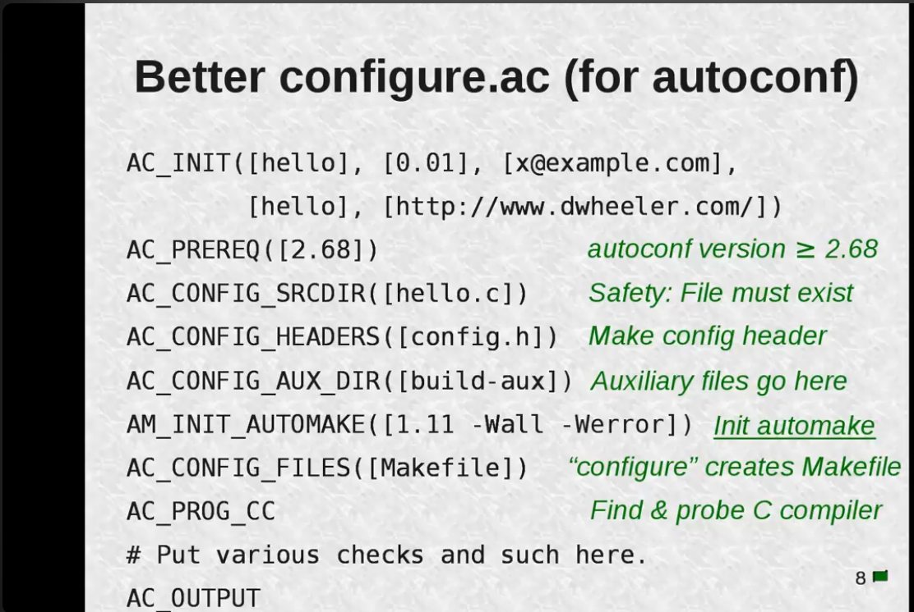
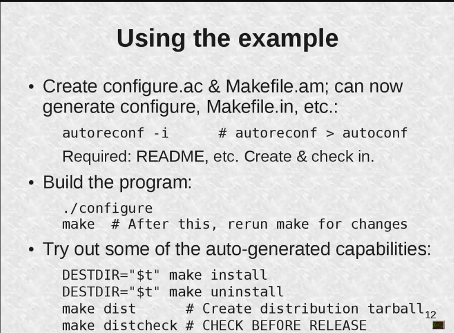

### 🔁 **High-Level Overview of GNU Autotools**

**Autotools** is a suite of tools that help developers make source code portable to different UNIX-like systems. The major components are:

| Tool         | Role                                                           |
| ------------ | -------------------------------------------------------------- |
| **Autoconf** | Creates `configure` scripts to detect system features.         |
| **Automake** | Generates portable `Makefile.in` templates from `Makefile.am`. |
| **Libtool**  | Helps in building portable shared/static libraries.            |

---

## ✅ Autotools Build Flow: Step-by-step

Let’s walk through what developers and users do.

---

### 👨‍💻 **Developer’s Role** (Creating the system):

1. **Write `configure.ac`**

   * Input for **Autoconf**.
   * Contains macros like `AC_INIT`, `AC_PROG_CC`, `AC_CONFIG_FILES`, etc.
   * Describes project metadata, compiler checks, feature tests.

2. **Write `Makefile.am`**

   * Input for **Automake**.
   * Very concise way to describe build rules (`bin_PROGRAMS`, `lib_LTLIBRARIES`, `include_HEADERS`, etc.)

3. **(Optional)** Write `autogen.sh`

   * A shell script that runs:

     ```sh
     autoreconf -i   # runs aclocal, autoheader, autoconf, automake, etc.
     ```
   * Yes, you're correct — it's a **wrapper** around `autoreconf -i` and often includes additional sanity checks.

4. **Run `autogen.sh` or `autoreconf -i`**

   * Generates:

     * `configure` (from `configure.ac`)
     * `Makefile.in` (from `Makefile.am`)
     * `aclocal.m4`, `config.h.in`, `autom4te.cache/`, etc.

---

### 👥 **User's Role** (Building the package):

1. **Run `./configure`**

   * Runs system checks.
   * Fills in template values from `Makefile.in` to generate `Makefile`.

2. **Run `make`**

   * Builds the software using the `Makefile`.

3. **Run `sudo make install`**

   * Installs binaries/libraries to `/usr/local` or `$DESTDIR`.

---

## 🧱 Technically, What Happens in Each File?

### 1. 🔧 `configure.ac` (Input for Autoconf)

Example:

```m4
AC_INIT([myapp], [1.0])
AM_INIT_AUTOMAKE
AC_PROG_CC
AC_CONFIG_HEADERS([config.h])
AC_CONFIG_FILES([Makefile])
AC_OUTPUT
```

* Defines project version, sets up compiler checks, declares output files.

---

### 2. 🛠️ `Makefile.am` (Input for Automake)

Example:

```make
bin_PROGRAMS = hello
hello_SOURCES = main.c hello.c
include_HEADERS = hello.h
```

* `automake` reads this and generates `Makefile.in`.

---

### 3. 🧩 `Makefile.in` (Template generated by automake)

Contains shell variables like:

```make
prefix = @prefix@
exec_prefix = @exec_prefix@
bindir = @bindir@
```

* `./configure` replaces these `@VAR@` values based on user system/config.

---

### 4. 📄 `Makefile` (Final build file used by `make`)

* Fully generated from `Makefile.in` by `./configure`.
* Contains real shell commands:

```make
hello.o: hello.c
	$(CC) $(CFLAGS) -c hello.c -o hello.o
```

---

## 📦 Bonus: Role of Libtool

If you're building shared/static libraries, `libtool` helps manage:

* Portable linking and building of `.so`/`.a` files.
* Integration into `Makefile.am` with `lib_LTLIBRARIES`.

---

## 📌 Summary Table

| File           | Created by       | Purpose                                               |
| -------------- | ---------------- | ----------------------------------------------------- |
| `configure.ac` | Developer        | Describes project, checks, and output                 |
| `Makefile.am`  | Developer        | Describes build targets in Automake syntax            |
| `configure`    | Autoconf         | Shell script to detect system and generate `Makefile` |
| `Makefile.in`  | Automake         | Template `Makefile` with `@VARS@`                     |
| `Makefile`     | configure script | Final build instructions used by `make`               |

---

## 🧠 Key Technical Benefits of Autotools

1. **Portability:** Works across UNIX/Linux/MinGW/FreeBSD/macOS.
2. **User customization:** Users can specify:

   * `--prefix=/opt/foobar`
   * `CC=clang CFLAGS=-O3 ./configure`
   * `DESTDIR` for staged installs
3. **Dependency resolution:** Checks for libraries/tools (`pkg-config`, headers).
4. **Out-of-source builds:** Supports building in separate directories.

---


This slide explains the **syntax rules and quirks** of the `configure.ac` file, which is written using **m4 macros** (macro processor).

#### ✅ Key Points:

1. **Written in a special language**:

   * It's technically **Bourne shell with m4 macros**. Autoconf processes this using `m4`.
   * While it looks like a shell script, it **runs through m4**, which interprets macros like `AC_INIT`, `AC_PROG_CC`, etc.

2. **Comment character**:

   * `#` is used to write comments (standard shell-style).

3. **Style rules from `m4`**:

   * **Brackets**:

     * Use `[]` to wrap macro parameters.
     * It avoids premature macro expansion. Even when optional, it's safer to always use brackets:

       ```m4
       AC_INIT([myprog], [1.0])  # good
       AC_INIT(myprog, 1.0)      # risky
       ```

   * **Whitespace rules**:

     * ❌ No space **before macro name** and `(` — this breaks m4:

       ```m4
       AC_INIT ([foo])   # wrong
       AC_INIT([foo])    # correct
       ```
     * ✅ Space **before parameter** is fine inside `[]`.
     * ❌ No space between parameters and commas or closing `)`.

---




#### 📄 Example:

```m4
AC_INIT([hello], [0.01], [x@example.com],
        [hello], [http://www.dwheeler.com/])
```

* **Project metadata**:

  * `[hello]`: package name
  * `[0.01]`: version
  * `[x@example.com]`: bug report email
  * `[hello]`: tarball name
  * `[http://...]`: project URL

---

```m4
AC_PREREQ([2.68])
```

* Require at least **Autoconf version 2.68**.

---

```m4
AC_CONFIG_SRCDIR([hello.c])
```

* Verifies the presence of this file to ensure it's the **right source directory**.

---

```m4
AC_CONFIG_HEADERS([config.h])
```

* Generate a **header file `config.h`** from `config.h.in` for feature macros like:

  ```c
  #define HAVE_STDLIB_H 1
  ```

---

```m4
AC_CONFIG_AUX_DIR([build-aux])
```

* Puts **helper scripts** (like `install-sh`, `missing`, etc.) in this custom directory instead of the default.

---

```m4
AM_INIT_AUTOMAKE([1.11 -Wall -Werror])
```

* Initialize **Automake**:

  * Require Automake ≥ 1.11
  * Add compiler flags `-Wall -Werror` for all builds

---

```m4
AC_CONFIG_FILES([Makefile])
```

* Tells Autoconf to generate a **Makefile** from `Makefile.in`

---

```m4
AC_PROG_CC
```

* Finds a working **C compiler** (`gcc`, `clang`, etc.).

---

```m4
# Put various checks and such here.
```

* Placeholder for feature tests like `AC_CHECK_LIB`, `AC_CHECK_HEADER`, etc.

---

```m4
AC_OUTPUT
```

* Final macro that **generates all output files** declared (e.g., `Makefile`, `config.h`, etc.)

---

### 🧠 Summary:

| Macro               | Purpose                           |
| ------------------- | --------------------------------- |
| `AC_INIT`           | Basic metadata                    |
| `AC_PREREQ`         | Require specific autoconf version |
| `AC_CONFIG_SRCDIR`  | Sanity check for source dir       |
| `AC_CONFIG_HEADERS` | Generate `config.h`               |
| `AC_CONFIG_AUX_DIR` | Location of helper scripts        |
| `AM_INIT_AUTOMAKE`  | Hook for Automake with options    |
| `AC_CONFIG_FILES`   | Files to generate (like Makefile) |
| `AC_PROG_CC`        | Find compiler                     |
| `AC_OUTPUT`         | Generate final files              |

---

Let me know if you want this example turned into a real working Autotools project with a `Makefile.am` and `main.c`.

### Example of how to use


---

## 🛠️ 1. Create `configure.ac` and `Makefile.am`

These are the **input files for Autoconf and Automake**.

Once these files are ready, you can generate the actual build infrastructure:

```bash
autoreconf -i
```

### 💡 What this does:

* Runs tools like `aclocal`, `autoconf`, `automake`, `autoheader`
* Generates:

  * `configure` (from `configure.ac`)
  * `Makefile.in` (from `Makefile.am`)
  * Support files like `config.h.in`, `aclocal.m4`, `install-sh`, etc.

🔹 Note: It mentions `autoreconf > autoconf` — this means `autoreconf` is a better and more comprehensive alternative to directly using `autoconf` (which only generates `configure`).

📌 **Also required**:

* You need files like `README`, `NEWS`, `AUTHORS`, `ChangeLog` for Automake to not warn/error.
* You should **create and version-control** these.

---

## ⚙️ 2. Build the program

Once setup files are generated, the typical **user build flow** is:

```bash
./configure
make
```

* `./configure`: Generates `Makefile` from `Makefile.in` and detects system settings.
* `make`: Compiles the code.
* 📝 After changing any source files, just re-run `make`.

---

## 🎁 3. Try Auto-generated Features

Autotools gives you **built-in, standardized targets** in the generated `Makefile`.

### 🚚 Installation:

```bash
DESTDIR="$t" make install
```

* Installs files into the directory specified by `$t`.
* Common in packaging to install into a **staging directory**.

### ❌ Uninstallation:

```bash
DESTDIR="$t" make uninstall
```

* Reverses the install step — again into `$t`.

### 📦 Create source tarball:

```bash
make dist
```

* Packages everything into a `.tar.gz` file.
* Based on files listed in `Makefile.am` and project files like `README`.

### 🧪 Pre-release test:

```bash
make distcheck
```

* Does:

  1. `make dist`
  2. Extracts tarball in temp dir
  3. Runs `./configure`, `make`, `make install`, and `make uninstall`
  4. Ensures everything works from a clean environment

✅ **Important for release QA!**

---

### 🔄 Summary Table

| Command                      | Purpose                                    |
| ---------------------------- | ------------------------------------------ |
| `autoreconf -i`              | Generates `configure`, `Makefile.in`, etc. |
| `./configure`                | Checks system, generates `Makefile`        |
| `make`                       | Builds the project                         |
| `DESTDIR="..." make install` | Staged installation                        |
| `make dist`                  | Creates distribution tarball               |
| `make distcheck`             | Full validation of tarball build/install   |


### Information about `aclocal.m4`

It is a generated file that contains macro definitions (written in m4 language) required by `autoconf` to process your `configure.ac` file properly.

#### How is it created?
When you run:
```bash
aclocal
```
or indirectly via:
```bash
autoreconf -i
```
→ aclocal.m4 is generated by scanning:
- your `configure.ac` for `AC_*` and `AM_*` macros,
- system macro directories (e.g., `/usr/share/aclocal/`),
- and optionally custom macro directories (e.g., `m4/`).

#### What does it contain?
It may include:
1. Macros from installed packages (like pkg.m4 from pkg-config)
2. Macros for libraries like Libtool (LT_INIT, etc.)
3. Any custom macros your project uses
4. Possibly expansions of macros used in your configure.ac

#### Modern Alternative: m4/ subdirectory
Instead of relying solely on aclocal.m4, the recommended approach today is:
1. Use AC_CONFIG_MACRO_DIR([m4]) in configure.ac
2. Set ACLOCAL_AMFLAGS = -I m4 --install in Makefile.am

This approach keeps macro files modular and under version control, while `aclocal.m4` is treated as a generated file.


#### Summary Table
| Purpose                | Details                                         |
| ---------------------- | ----------------------------------------------- |
| What is it?            | m4 macro container file used by `autoconf`      |
| How is it generated?   | By `aclocal` or `autoreconf -i`                 |
| Why needed?            | Provides definitions for non-standard macros    |
| Should you edit it?    | ❌ Never manually — it’s auto-generated          |
| Should you version it? | ❌ No — regenerate during build system bootstrap |

#### Analogy for relation btw aclocal and configure.ac
You can think of `aclocal.m4` as a macro dictionary. When autoconf reads `configure.ac` and encounters a word it doesn’t understand (a macro), it looks up its meaning in aclocal.m4.

| Concept              | Role                                                     |
| -------------------- | -------------------------------------------------------- |
| `configure.ac`       | Uses macros to define build checks and structure         |
| `aclocal.m4`         | Supplies macro definitions to `autoconf`                 |
| `autoconf`           | Expands macros from `configure.ac` using `aclocal.m4`    |
| Without `aclocal.m4` | Autoconf may fail to process external/third-party macros |
