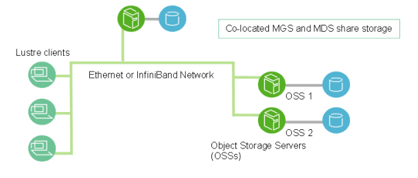

# Lustre Architecture

Lustre is a high-performance, distributed parallel filesystem designed for scalability and efficiency in large-scale computing environments, such as supercomputers and HPC clusters. Its architecture separates metadata (file and directory information) from data (file contents) across specialized servers, enabling parallel I/O and massive scalability. This document provides a comprehensive overview of Lustre’s architecture, components, mechanisms, and workflows, using a warehouse analogy to map roles.

## Part 1: Overview of Lustre Architecture

Lustre is built for environments requiring petabytes of storage and terabytes/second throughput. It achieves this by distributing tasks across specialized servers and clients, connected via a high-speed networking layer called **LNet**. By separating metadata and data operations, Lustre ensures efficient parallel access and scalability.

### 1.1 Core Components and Warehouse Analogy

Lustre’s components can be likened to roles in a warehouse operation, each handling specific tasks to manage the filesystem efficiently.

| **Warehouse Role**   | **Lustre Component** | **Server vs Target**           | **Function**                                                                                            | **BeeGFS Equivalent**        |
|----------------------|----------------------|--------------------------------|---------------------------------------------------------------------------------------------------------|------------------------------|
| **Receptionist**     | MGS / MGT            | Management Server / Target     | Initial contact point; provides configuration log with MDS/OSS addresses stored on MGT.                  | `beegfs-mgmtd` (combined)    |
| **Manager**          | MDS / MDT            | Metadata Server / Target       | Manages directory structure, filenames, permissions, and file layout maps stored on MDT.                 | `beegfs-meta` + metadata dir |
| **Warehouse Worker** | OSS / OST            | Object Storage Server / Target | Stores and retrieves data objects; unaware of file/directory structure.                                 | `beegfs-storage` + data dir  |
| **Client (You)**     | —                    | Lustre Client                  | Mounts filesystem; coordinates with MGS, MDS, and OSS for metadata and data operations.                 | `beegfs-client`              |

> **Note**:
> - **Server**: Active daemon handling requests.
> - **Target**: Physical storage device or disk group used by the server.

### 1.2 Why Lustre?

Lustre is designed for high-performance computing (HPC) environments where traditional filesystems (e.g., ext4, NTFS) struggle with scale and speed. By splitting metadata and data across multiple servers, Lustre enables parallel I/O, making it ideal for supercomputers, research clusters, and large-scale data processing.

- **Analogy**: Think of Lustre as a massive library. Metadata servers (MDS) act as librarians tracking where books are stored (but not holding the books themselves), object storage servers (OSS) are warehouse workers managing the actual books, and clients are readers accessing the library system.

## Part 2: Detailed Component Breakdown

### 2.1 Management Server/Target (MGS/MGT)

- **What it is**: The MGS is the “receptionist” providing initial configuration details. The MGT is a small storage device holding the filesystem’s configuration log.
- **Function**:
  - Stores the “cluster map” (locations of MDS and OSS servers) on the MGT.
  - Clients and servers connect to the MGS once during startup (mount) to retrieve this map, then communicate directly with MDS/OSS.
- **Key Points**:
  - MGT storage is minimal, as it only holds configuration data (not file data or metadata).
  - MGS is often co-located with the primary MDS to optimize hardware usage.
- **Analogy**: A hotel concierge giving you a city map when you check in. You only need to talk to them once to know where to go.
- **Example**: When a client runs `mount -t lustre mgs:/lustre /lustre`, the MGC (Management Client) asks the MGS for MDS/OSS addresses.

### 2.2 Metadata Server/Target (MDS/MDT)

- **What it is**: The MDS is the “librarian” managing file and directory metadata. The MDT is the storage device (e.g., SSD) holding this metadata.
- **Function**:
  - Handles namespace operations: creating/deleting files/directories, listing contents (`ls`), checking permissions (`stat`).
  - Stores metadata on the MDT, including:
    - **Files**: Name, owner, permissions, timestamps, and a **striping map** pointing to OSTs where data is stored.
    - **Directories**: A list of files/subdirectories, with pointers to their metadata (directories are special files containing such lists).
  - Every Lustre filesystem requires at least one MDT for the root directory (`/`).
- **High Availability (HA)**:
  - One MDT is managed by one active MDS, but can have a passive MDS for failover. If the active MDS fails, the passive MDS takes over the same MDT.
  - Each MDS manages exactly one MDT (1:1 pairing).
- **Analogy**: A librarian with a catalog (MDT) listing where every book is stored. Asking for “report.txt” returns its metadata and pointers to data locations.
- **Example**: Running `mkdir /lustre/project1` sends a request to the MDS, which creates a metadata entry for `project1` on the MDT.

### 2.3 Object Storage Server/Target (OSS/OST)

- **What it is**: The OSS is the “warehouse worker” handling file data I/O. The OST is the physical storage device (e.g., HDD, SSD, logical volume) holding data.
- **Function**:
  - OSS manages data transfers to/from OSTs.
  - Files are split into **objects** (chunks) and **striped** across multiple OSTs for parallel I/O, boosting throughput.
  - Each OSS typically manages 2–8 OSTs. Filesystem capacity is the sum of all OSTs.
- **Key Points**:
  - OSS/OSTs are unaware of file structure (e.g., directories); they only store/retrieve raw data objects.
  - Striping allows simultaneous read/write across multiple OSTs.
- **Analogy**: Workers fetching book pages from storage bins (OSTs). A book’s pages are scattered across bins for faster retrieval.
- **Example**: A 4GB file striped across 4 OSTs has 1GB objects on each. Reading it involves 4 OSSs fetching data in parallel.

### 2.4 Clients

- **What it is**: Nodes (e.g., compute servers, desktops) running Lustre client software to access the filesystem.
- **Function**:
  - Mounts the filesystem (e.g., `/lustre`) and presents a POSIX-compliant interface to applications.
  - Coordinates with MGS (initially), MDS (metadata), and OSS (data).
  - Clients are “smart,” caching metadata and managing parallel I/O.
- **Analogy**: Library patrons who talk to the receptionist (MGS), librarian (MDS), and warehouse workers (OSS) to get books.
- **Example**: Running `cat /lustre/my_file` triggers the client to fetch metadata from MDS and data from OSS.

### 2.5 Lustre Networking (LNet)

- **What it is**: A custom, high-performance communication layer for low-latency, high-bandwidth data and metadata transfers.
- **Function**: Connects clients, MGS, MDS, and OSS over high-speed networks (e.g., InfiniBand, RDMA-enabled Ethernet). Optimized to reduce overhead compared to TCP/IP.
- **Analogy**: A dedicated express courier service for the library, faster than regular mail.
- **Example**: When fetching data from OSS, LNet ensures rapid transfer over InfiniBand.

## Part 3: Client-Side Architecture

The Lustre client software runs in the Linux kernel as a team of specialized modules, translating standard filesystem commands (e.g., `open`, `read`, `mkdir`) into network requests to the appropriate servers. It hides the distributed backend’s complexity, presenting a unified POSIX-compliant filesystem.

### 3.1 Client Components

- **Management Client (MGC)**:
  - **Role**: Communicates with the MGS.
  - **Function**: Downloads the filesystem configuration (“cluster map”) from MGS during mount, identifying MDS/OSS locations. Rarely used after initial contact unless configuration changes.
  - **Analogy**: A scout sent to the concierge to get the city map.
  - **Example**: During `mount -t lustre mgs:/lustre /lustre`, MGC fetches the configuration from MGS.
  - **Implementation**: A Linux kernel module (`mgc.ko`).

- **Metadata Client (MDC)**:
  - **Role**: Handles namespace operations by communicating with MDS.
  - **Function**: Processes metadata requests (e.g., `ls`, `stat`, `mkdir`, file opens). Manages file locks and interprets MDS responses.
  - **Analogy**: A library assistant asking the librarian for book locations.
  - **Example**: Running `ls /lustre` triggers MDC to query MDS for directory contents.
  - **Implementation**: A Linux kernel module (`mdc.ko`).

- **Object Storage Client (OSC)**:
  - **Role**: Manages data I/O by communicating with OSS.
  - **Function**: Reads/writes file content. One OSC exists per OST, enabling parallel I/O for striped files (e.g., a file striped across 16 OSTs uses 16 OSCs).
  - **Analogy**: Delivery workers fetching book pages from specific warehouse bins.
  - **Example**: Reading a file striped across 16 OSTs uses 16 OSCs to fetch data simultaneously.
  - **Implementation**: A Linux kernel module (`osc.ko`).

### 3.2 Logical Layers

- **Logical Object Volume (LOV)**:
  - **What it is**: A virtual layer unifying all OSTs into a single logical storage pool.
  - **Function**: Manages file striping by interpreting striping maps from MDS, directing OSCs to correct OSTs for parallel I/O.
  - **Analogy**: A personal shopper providing a map of where file chunks are stored, so workers can fetch them in parallel.
  - **Example**: For a file striped across OSTs 1, 5, 9, LOV tells OSCs, “Fetch chunk 1 from OST 1, chunk 2 from OST 5, etc.”
  - **Implementation**: A Linux kernel module (`lov.ko`).

- **Logical Metadata Volume (LMV)**:
  - **What it is**: A virtual layer unifying all MDTs into a single directory tree.
  - **Function**: Directs MDC to the correct MDT for distributed directories (e.g., `/users` on MDT-1, `/projects` on MDT-2).
  - **Analogy**: A library’s main information desk routing you to the right librarian for fiction or non-fiction.
  - **Example**: Accessing `/lustre/projects` triggers LMV to route the MDC to MDT-2.
  - **Implementation**: A Linux kernel module (`lmv.ko`).

## Part 4: Scaling Metadata with Distributed Namespace Environment (DNE)

DNE addresses metadata performance bottlenecks when a single MDS/MDT pair handles too many operations, common in filesystems with billions of files.

### 4.1 DNE Phase 1 (Per-Subtree)

- **Mechanism**: Assigns specific subdirectories to additional MDS/MDT pairs to distribute metadata load.
- **Process**:
  1. The primary MDT (MDT-0) holds the root directory (`/`).
  2. A subdirectory (e.g., `/data/project_X`) is assigned to a new MDT (e.g., MDT-1).
  3. MDT-0 creates a referral pointer for `/data/project_X`, redirecting clients to MDS-1/MDT-1.
  4. Clients access `/data/project_X` directly via MDS-1, reducing load on MDS-0.
- **Analogy**: Splitting library sections (fiction, non-fiction) across different librarians to reduce crowding at one desk.
- **Example**: `/data/project1` on MDT-1 handles all metadata for that directory, offloading MDT-0.
- **Benefit**: Distributes metadata operations across multiple MDS/MDT pairs.

### 4.2 DNE Phase 2 (Striped Directories)

- **Mechanism**: Stripes a single directory’s metadata across multiple MDTs (introduced in Lustre 2.8).
- **Benefit**: Scales metadata operations within a single directory, ideal for directories with millions of files.
- **Analogy**: Dividing a single card catalog into multiple sections, each handled by a different librarian.
- **Example**: A directory with 10M files has its metadata split across 4 MDTs, speeding up `ls` or `mkdir`.

## Part 5: Key Mechanisms

### 5.1 File Striping

- **What it is**: Splitting files into **objects** (chunks) and distributing them across multiple OSTs.
- **Why it’s needed**: Enables parallel I/O, increasing throughput for large files.
- **How it works**: The MDS provides a striping map (e.g., “chunk 1 on OST 5, chunk 2 on OST 6”). LOV uses this map to direct OSCs.
- **Analogy**: Splitting a book into chapters and storing each in a different bin for faster retrieval.
- **Example**: A 4GB file with a 1MB stripe size across 4 OSTs has 1GB per OST, read in parallel by 4 OSCs.

### 5.2 High Availability (HA)

- **Mechanism**: MDS/MDT pairs support active-passive failover. Two MDS servers manage one MDT; if the active MDS fails, the passive takes over.
- **Analogy**: A backup librarian ready to step in if the primary one is unavailable.
- **Example**: If MDS-0 crashes, MDS-1 activates, accessing MDT-0 to continue serving metadata.

### 5.3 POSIX Compliance

- **What it is**: Lustre clients provide a standard Unix-like filesystem interface, allowing familiar commands (`ls`, `cat`, `mkdir`).
- **Analogy**: The library’s front desk makes it feel like a single, familiar library, despite distributed storage.
- **Example**: Running `vim /lustre/my_file` works like on a local filesystem.

### 5.4 Kernel Modules

- **What they are**: MGC, MDC, OSC, LOV, and LMV are Linux kernel modules (e.g., `mgc.ko`, `lov.ko`) loaded during mount.
- **Function**: Integrate Lustre with the OS, handling network requests and filesystem operations.
- **Analogy**: Specialized tools in a Swiss Army knife, each for a specific task.
- **Example**: Mounting `/lustre` loads `lov.ko` to manage striping.

## Part 6: Workflow Example

Here’s how a client accesses `/lustre/my_file`:

1. **Mount Filesystem**:
   - MGC contacts MGS to retrieve the cluster map (MDS/OSS locations) via LNet.
2. **Open File**:
   - MDC asks MDS for `my_file`’s metadata.
   - MDS checks MDT, returns permissions and striping map (e.g., OSTs 1, 5, 9).
3. **Read Data**:
   - LOV interprets the map, directing OSCs to OSSs managing OSTs 1, 5, 9.
   - OSCs fetch data in parallel over LNet.
4. **Application View**:
   - The client presents `my_file` as a single file, hiding all complexity.

## Part 7: Hardware & Storage Recommendations

| **Component** | **Storage Needs**                   | **Hardware Suggestions**                                           |
|---------------|-------------------------------------|--------------------------------------------------------------------|
| **MDS**       | 1–2% of total filesystem size       | Strong CPU, high RAM, fast disks (e.g., SSDs)                       |
| **OSS**       | 1–128 TiB per OST; 1–8 OSTs per OSS | Balanced storage-to-network bandwidth; high internal bus bandwidth |
| **Client**    | No Lustre-specific storage required | High-bandwidth, low-latency networking (e.g., InfiniBand, RDMA)    |

## Part 9: Key Takeaways

- **Separation of Duties**: Metadata (MDS/MDT) and data (OSS/OST) are handled separately for efficiency.
- **Parallel I/O**: Striping and multiple OSCs enable simultaneous data access across OSTs.
- **Scalability**: DNE and additional MDS/MDT or OSS/OST pairs handle growing workloads.
- **High Availability**: Active-passive MDS pairs ensure reliability.
- **Unified Interface**: Clients hide complexity, providing a POSIX-compliant filesystem.