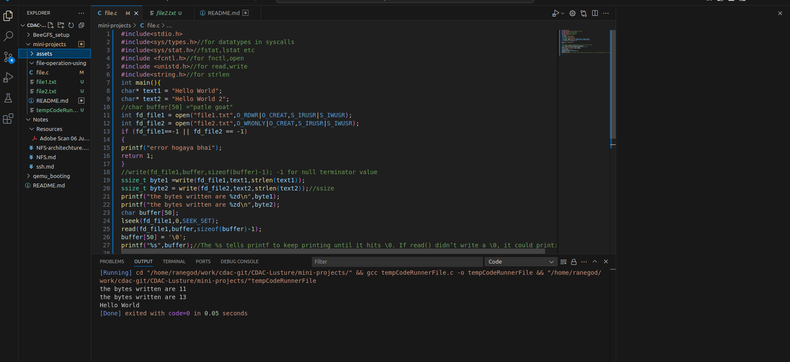

# File Operations in C

This program demonstrates basic file operations in C using system calls on Unix-like systems (Linux). It shows how to create, write to, and read from files using low-level file descriptors.

## Overview

The program creates two files (`file1.txt` and `file2.txt`), writes text to them, then reads back the content from the first file and displays it.

## Headers Used

### `#include <stdio.h>`
- Standard I/O library for `printf()` function

### `#include <sys/types.h>`
- Defines **data types** used in system calls for portability across platforms
- Common types:
  - `pid_t` – Process ID
  - `uid_t`, `gid_t` – User ID and Group ID types
  - `mode_t` – File permission/mode type
  - `off_t` – File sizes and offsets
  - `size_t` – Object sizes (unsigned)
  - `ssize_t` – Signed size type (can return -1 for errors)

### `#include <sys/stat.h>`
- Defines structures and constants for file status operations
- Provides file permission macros like `S_IRUSR`, `S_IWUSR`
- Contains functions like `stat()`, `fstat()`, `lstat()`

### `#include <fcntl.h>`
- File control operations
- Defines flags for `open()` function like `O_RDWR`, `O_CREAT`, `O_WRONLY`

### `#include <unistd.h>`
- Unix standard definitions
- Contains `read()`, `write()`, `lseek()`, `close()` functions

### `#include <string.h>`
- String manipulation functions
- Used here for `strlen()` to get string length

## Key Functions and Parameters

### `open()` Function
```c
int open(const char *pathname, int flags, mode_t mode);
```

**Parameters:**
- `pathname`: Path to the file (e.g., "file1.txt")
- `flags`: Access modes and options
  - **Access modes** (choose one):
    - `O_RDONLY` – Read only
    - `O_WRONLY` – Write only  
    - `O_RDWR` – Read and write
  - **Options** (can be OR'd with `|`):
    - `O_CREAT` – Create file if it doesn't exist
    - `O_APPEND` – Write at end of file
    - `O_TRUNC` – Truncate file to zero length
- `mode`: File permissions (only used with `O_CREAT`)
  - `S_IRUSR` – Read permission for owner
  - `S_IWUSR` – Write permission for owner
  - `S_IXUSR` – Execute permission for owner

**Returns:** File descriptor (non-negative integer) on success, -1 on error

### `write()` Function
```c
ssize_t write(int fd, const void *buf, size_t count);
```

**Parameters:**
- `fd`: File descriptor returned by `open()`
- `buf`: Pointer to data to write
- `count`: Number of bytes to write

**Returns:** Number of bytes written on success, -1 on error

### `read()` Function
```c
ssize_t read(int fd, void *buf, size_t count);
```

**Parameters:**
- `fd`: File descriptor
- `buf`: Buffer to store read data
- `count`: Maximum number of bytes to read

**Returns:** Number of bytes read on success, 0 at EOF, -1 on error

### `lseek()` Function
```c
off_t lseek(int fd, off_t offset, int whence);
```

**Parameters:**
- `fd`: File descriptor
- `offset`: Number of bytes to move
- `whence`: Starting position
  - `SEEK_SET` – Beginning of file
  - `SEEK_CUR` – Current position
  - `SEEK_END` – End of file

**Returns:** New file offset on success, -1 on error

## Data Types

### `size_t` vs `ssize_t`
- `size_t`: Unsigned integer for sizes (always positive)
- `ssize_t`: Signed version, can return -1 to indicate errors

### Printf Format Specifiers
- `%zu`: For printing `size_t` (unsigned)
- `%zd`: For printing `ssize_t` (signed)

## Code Walkthrough

1. **File Creation**: Opens two files with different permissions
   - `file1.txt`: Read/Write mode (`O_RDWR`)
   - `file2.txt`: Write only mode (`O_WRONLY`)

2. **Error Checking**: Verifies file descriptors are valid (not -1)

3. **Writing Data**: Writes different text strings to each file using `write()`

4. **Reading Data**: 
   - Uses `lseek()` to move file pointer back to beginning
   - Reads data into buffer using `read()`
   - **Important**: Uses `sizeof(buffer)-1` to leave space for null terminator

5. **Buffer Management**: 
   - Sets null terminator manually: `buffer[50] = '\0'`
   - This ensures the string is properly terminated for `printf()`

## Important Notes

### Why `sizeof(buffer) - 1`?
When reading data that will be treated as a string, we reserve one byte for the null terminator (`\0`). This prevents buffer overflow and ensures proper string handling.

### Error Handling
Always check if file descriptors are -1, which indicates an error in file operations.

### Memory Safety
The program manually adds a null terminator to ensure safe string printing with `printf()`.

## Compilation and Execution

```bash
gcc -o file_operations file.c
./file_operations
```

## Expected Output



```
the bytes written are 11
the bytes written are 13
Hello World
```

## Files Created
- `file1.txt`: Contains "Hello World"
- `file2.txt`: Contains "Hello World 2"

## Bug Fix Note
There's a small bug in the original code: `buffer[50] = '\0';` should be `buffer[49] = '\0';` or better yet, `buffer[bytes_read] = '\0';` where `bytes_read` is the return value from `read()`.
